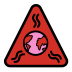

# openmoji-environment

|                              |                                 |
| ---------------------------- | ------------------------------- |
| CO2e on a trone              | CO2                             |
|            |                |
| Methane                      | Nitrous oxide                   |
|         |                |
| Coal Plant                   | Coal mine excavator             |
|      |     |
| Greenwashing                 | Greenhouse effect               |
|    |  |
| Climate change               |                                 |
|  |                                 |

Complete the open source emoji set _openmoji_ with more environmental emojis.

We've identified openmoji as the best chance to illustrate these crucial topics, but their ["climate-environment"](https://openmoji.org/library/#group=extras-openmoji%2Fclimate-environment) extra emoji list is quite incomplete and subjective at the moment.

I haven't read yet the process to submit new emojis to openmoji [(how to name them, etc.)](https://github.com/hfg-gmuend/openmoji/blob/master/CONTRIBUTING.md), so this is a work repository meanwhile.

Keep in mind that these emojis won't make it to your messaging app, until unicode approves their need, and Apple, Google & co make their own version in their operating system.
